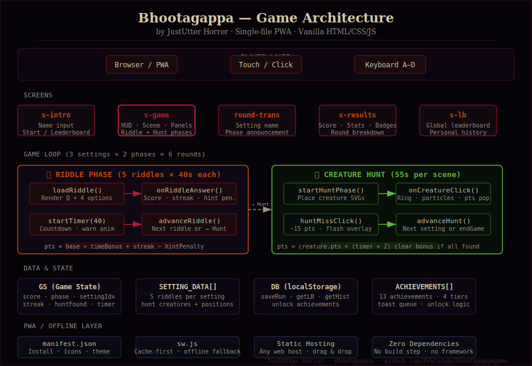

# 🏗 Bhootagappa — Architecture & Code Explanation

> **by JustUtter Horror** · Single-file PWA · Zero dependencies · Zero build step

---

## Overview

Bhootagappa is a **single HTML file game** (`public/index.html`) bundled with a service worker and PWA manifest for offline-first, installable play. The entire game — 1,057 lines of HTML, CSS, and vanilla JavaScript — runs in any modern browser with no server, no framework, and no build pipeline.

```
public/
├── index.html      ← The entire game lives here
├── manifest.json   ← PWA installability config
├── sw.js           ← Offline service worker
└── icons/          ← App icons (SVG + PNG)
```

---

## Architecture Diagram



---

## Game Flow

Each play-through runs **6 rounds** across 3 horror settings, alternating between two phases:

```
START
  │
  ▼
┌─────────────────────────────────────────────────┐
│  Setting 1: Thornwood Manor                     │
│  ┌────────────────┐     ┌────────────────────┐  │
│  │ 📜 RIDDLE PHASE │ ──► │  👁 CREATURE HUNT  │  │
│  │  5 riddles     │     │  5 hidden creatures│  │
│  │  40s per Q     │     │  55s to find all   │  │
│  └────────────────┘     └────────────────────┘  │
└─────────────────────────────────────────────────┘
  │
  ▼ (repeat for Settings 2 & 3)
  │
┌─────────────────────────────────────────────────┐
│  Setting 2: Ravenscroft Asylum                  │
│  Setting 3: The Darkwood                        │
└─────────────────────────────────────────────────┘
  │
  ▼
RESULTS SCREEN  →  LEADERBOARD
```

---

## Core Systems

### 1. Game State (`GS` object)

All live game data lives in a single plain object — no reactivity framework needed:

```js
const GS = {
  player, score,
  settingIdx,     // 0 = Manor, 1 = Asylum, 2 = Forest
  phase,          // 'riddle' | 'hunt'
  riddleIdx,      // 0–4 within current setting
  timer,          // countdown seconds
  correctStreak,  // multiplier for bonus points
  huntFound,      // Set() of found creature IDs
  roundLog,       // array of round summaries for results screen
  ...
}
```

### 2. Data Layer (`SETTING_DATA` + `SETTINGS`)

All riddles and creature positions are declared as static arrays — no API calls, no database:

```js
const SETTING_DATA = [
  {
    riddles: [
      {
        q: "The riddle text...",
        hint: "A clue if stuck...",
        answers: ["A", "B", "C", "D"],
        correct: 0,          // index of correct answer
        pts: 200             // base points
      },
      // × 5 per setting
    ],
    hunt: {
      desc: "Scene flavour text",
      creatures: [
        {
          id: 'ghost',
          label: 'Wailing Ghost',
          x: 15, y: 10,      // % position in viewport
          w: 8,  h: 11,      // % size
          pts: 120,
          draw: 'ghost',     // maps to drawGhost() SVG function
          anim: 'creatureFloat 3s ease-in-out infinite'
        },
        // × 5–7 per setting
      ]
    }
  }
]
```

### 3. Riddle Phase

```
loadRiddle()
    │
    ├── Renders question text + 4 answer buttons
    ├── Starts 40s countdown timer
    │
onRiddleAnswer(chosen, correct, basePts)
    │
    ├── CORRECT:
    │     score += basePts
    │             + (timer × 3)        ← time bonus
    │             + (streak - 1) × 30  ← streak bonus
    │             - (hintUsed ? basePts × 0.3 : 0)
    │     correctStreak++
    │
    └── WRONG:
          score -= 50
          correctStreak = 0
          reveal correct answer
    │
advanceRiddle()
    │
    ├── riddleIdx < 5  →  loadRiddle()
    └── riddleIdx == 5  →  showRoundTrans() → startHuntPhase()
```

### 4. Creature Hunt Phase

Creatures are SVG elements absolutely positioned in a `#hunt-scene-layer` div overlaid on the scene:

```
startHuntPhase()
    │
    ├── Places creature SVGs at (x%, y%) positions from SETTING_DATA
    ├── Each creature: click → onCreatureClick()
    ├── Bare scene click → huntMissClick() → -15pts
    └── Starts 55s timer
    │
onCreatureClick(creature, element, event)
    │
    ├── score += creature.pts + (timer × 2)
    ├── Spawns found-ring animation at click coords
    ├── Spawns particle burst (7 dots)
    ├── Fades creature to 30% opacity
    ├── Marks creature chip in panel
    └── All found → clear bonus (timer × 8) → advanceHunt()
```

### 5. SVG Creature Rendering

Every creature is drawn procedurally — no image files. Each has a dedicated draw function:

```js
const CREATURE_FNS = {
  ghost:     drawGhost(),       // Translucent wisp, red pupils
  skull:     drawSkull(),       // Bone-coloured cranium, dark eye sockets
  eye:       drawEyeCreature(), // Wide almond eye with blood veins
  spider:    drawSpider(),      // Web + body + 8 legs
  figure:    drawShadowFigure(),// Dark humanoid silhouette
  doll:      drawDoll(),        // Cracked porcelain face, red dress
  witch:     drawWitch(),       // Pointed hat, glowing eyes, star robe
  bat:       drawBat(),         // Spread wings, red eyes, fangs
  werewolf:  drawWerewolf(),    // Snout, claws, yellow eyes
  vampire:   drawVampire(),     // Cape, pale face, blood drip
}
```

### 6. Persistence (`DB` object)

All player data is stored in `localStorage` — no backend required:

```js
DB.saveRun(name, score, data)   // saves run, updates best score
DB.getLB()                       // returns top 20 players sorted by best score
DB.getHist(name)                 // returns last 20 runs for a player
DB.unlock(name, achievementId)   // returns true if newly unlocked
```

**Data shape per player:**
```json
{
  "name": "Pratik",
  "bestScore": 4820,
  "runs": 7,
  "lastDate": 1709567234000,
  "history": [
    {
      "score": 4820,
      "correct": 13,
      "total": 15,
      "accuracy": 87,
      "creaturesFound": 17,
      "creaturesPossible": 18,
      "elapsed": 312,
      "date": 1709567234000
    }
  ]
}
```

### 7. Scoring Summary

| Event | Points |
|-------|--------|
| Riddle correct (base) | 180 – 260 pts |
| Time bonus (riddle) | `timer × 3` |
| Streak bonus | `(streak − 1) × 30` |
| Hint penalty | `−30%` of base |
| Wrong riddle answer | `−50 pts` |
| Creature found (base) | 90 – 160 pts |
| Time bonus (hunt) | `timer × 2` |
| Hunt clear bonus | `timer × 8` |
| Miss click | `−15 pts` |

### 8. Achievement System

```js
// Unlocking is idempotent — safe to call every answer
function checkAch_riddle() {
  if (GS.totalCorrect >= 1)        unlock('first_blood')
  if (GS.answeredWithoutHint >= 5) unlock('no_hint')
  if (timeTaken < 4)               unlock('speedrun')
  if (GS.correctStreak >= 3)       unlock('combo_master')
  if (GS.score >= 3000)            unlock('high_score')
  if (GS.score >= 6000)            unlock('legend')
}

// On game end
if (GS.hintThisGame === 0)                         unlock('no_hints_game')
if (accuracy === 100)                              unlock('iron_mind')
if (creaturesFound === creaturesPossible)           unlock('master_hunter')
```

Unlocked achievements fire a toast notification via a **queue system** (`toastQ`) to avoid overlapping toasts.

### 9. PWA / Offline

```
Browser loads index.html
    │
    └── Registers sw.js
            │
            ├── INSTALL: caches index.html, manifest, icons
            │
            ├── FETCH (own origin): Cache-first
            │     → serve from cache, update in background
            │
            └── FETCH (external, e.g. Google Fonts): Network-first
                  → fallback to cache if offline
```

---

## Settings & Creatures Reference

| Setting | Riddles | Creatures | Hunt Timer |
|---------|---------|-----------|------------|
| Thornwood Manor | 5 | Ghost, Vampire, Skull, Spider, Bat (5) | 55s |
| Ravenscroft Asylum | 5 | Shadow, Eye, Spider, Skull, Doll, Ghost (6) | 55s |
| The Darkwood | 5 | Witch, Werewolf, Bat, Wraith, Eye, Spider, Skull (7) | 55s |

---

## Customising the Game

All game content is in plain arrays — no config files needed:

**Add a riddle:**
```js
// In SETTING_DATA[0].riddles — push a new object:
{
  q: "Your riddle text here...",
  hint: "A subtle clue.",
  answers: ["Option A", "Option B", "Option C", "Option D"],
  correct: 2,   // 0-indexed
  pts: 200
}
```

**Add a creature to a hunt:**
```js
// In SETTING_DATA[0].hunt.creatures:
{
  id: 'bat',
  label: 'Cave Bat',
  x: 45, y: 20,   // % from top-left of viewport
  w: 8,  h: 5,    // % width/height
  pts: 110,
  draw: 'bat',    // must match a key in CREATURE_FNS
  anim: 'creatureFloat 2s ease-in-out infinite'
}
```

**Change timers:**
```js
startTimer(40)   // riddle phase — change 40 to any seconds
startTimer(55)   // hunt phase   — change 55 to any seconds
```

---

*JustUtter Horror · Bhootagappa · Built with pure HTML/CSS/JS*
